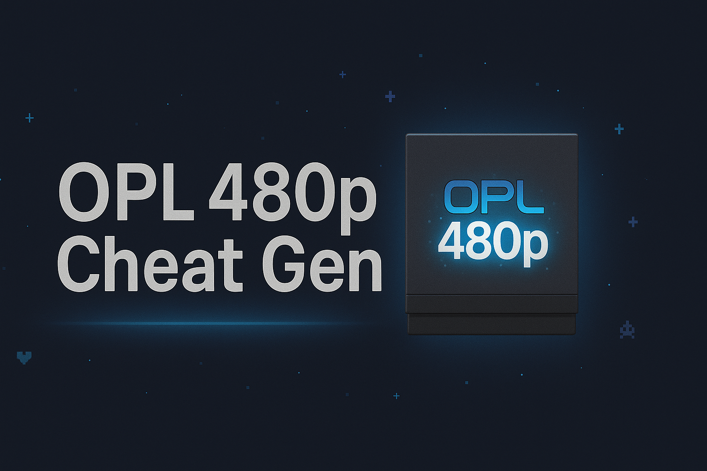
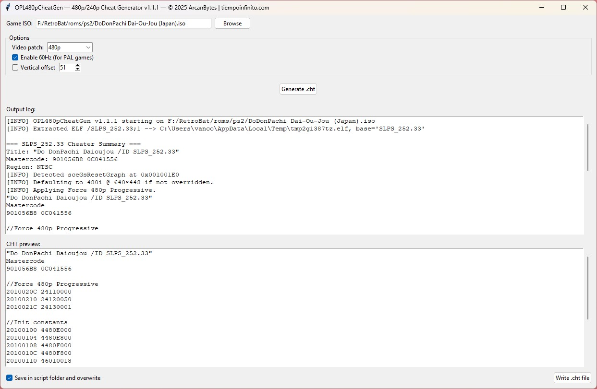
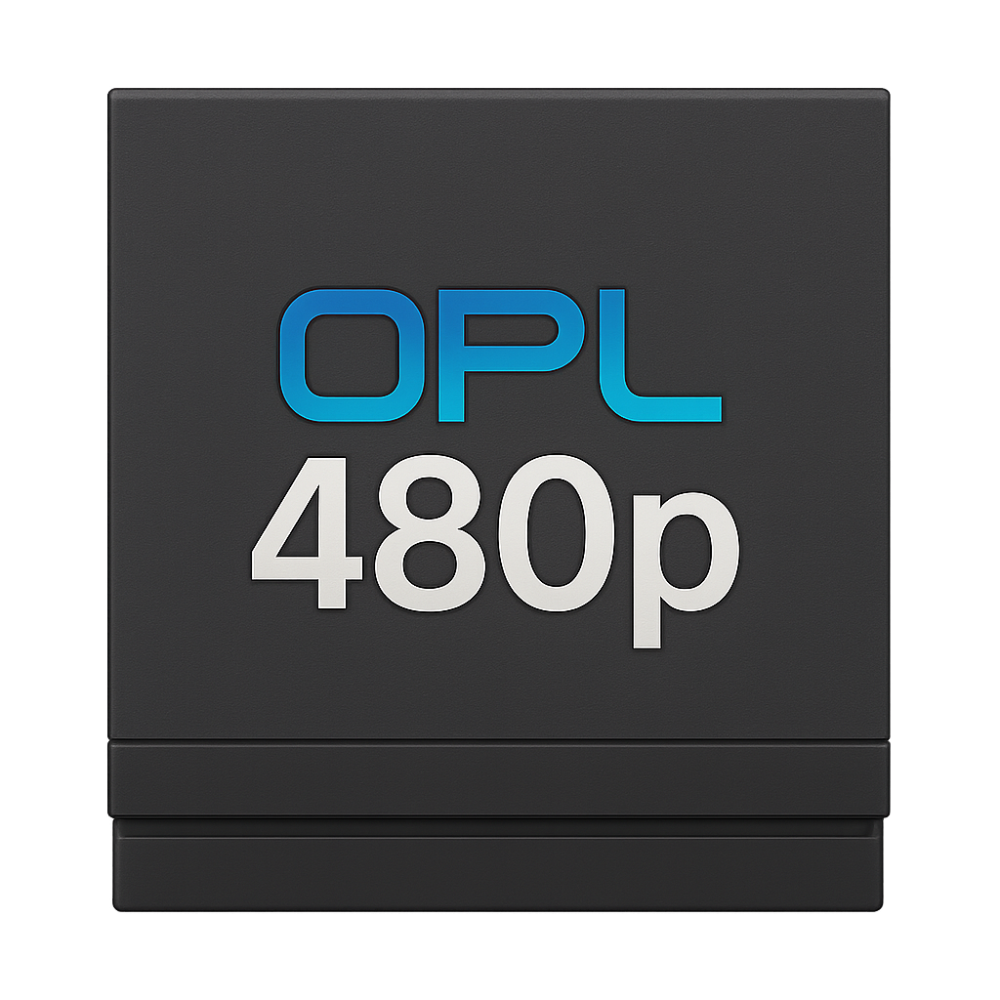

# OPL480pCheatGen




**OPL480pCheatGen** is a tool for generating `.cht` cheat files compatible with [Open PS2 Loader (OPL)](https://github.com/ifcaro/Open-PS2-Loader), allowing you to force progressive video modes, 480p or 240p, in your PlayStation 2 games **without modifying ISOs**.

> ✅ No patching required  
> ✅ Runs offline  
> ✅ Generates `.cht` files for use with OPL  
> ✅ Works directly with ISO files

---

## 📦 Download

You can always get the latest compiled version here:
👉 [Download Latest Release](https://github.com/arcanbytes/OPL480pCheatGen/releases/latest)

---

## ⚙️ Features

- ✅ **Force 480p output**
- ✅ **Optional Patches**:
  - Force 240p output
  - Enable PAL 60Hz (for PAL-region games; auto-skips if 60Hz is already present)
  - Adjust vertical offset (DY)
   
- ✅ **Auto-detect ELF from ISO** via `SYSTEM.CNF` (no user input needed)
- ✅ **Video Mode Detection**: 480p, 240p, and 480i
- ✅ **Fully Offline**: Loads titles and mastercodes from a built-in database (5300+ entries)
- ✅ **Supports GUI and CLI**

---

## 🖥️ Graphical Interface (Recommended)

Run `OPL480pCheatGenGUI.exe`:

- Select an ISO 
- Choose your patch options
- Preview the `.cht` content
- Click **Write .cht file** to save

✔️ Saves `.cht` next to the `.exe` by default  
✔️ Ideal for use with OPL Manager Cheat Editor 



---

## 🧪 Command-Line Interface

Open a Windows command line terminal and run `OPL480pCheatGen.exe`. The resulting .cht file will be saved in the same folder where you launched the program.

```bash
# Basic usage examples
OPL480pCheatGen.exe "F:\RetroBat\roms\ps2\Game.iso" 
OPL480pCheatGen.exe "F:\RetroBat\roms\ps2\Game.iso" --force-240p
OPL480pCheatGen.exe "F:\RetroBat\roms\ps2\Game.iso" --preview-only 

# Optional flags:
--preview-only        # Show .cht content in console, do not write file
--pal60               # Enable PAL 60Hz mode (auto-skipped if already supported)
--force-240p          # Use 240p instead of 480p
--dy 51               # Override vertical offset (DY)
--mastercode "CODE"   # Manually override mastercode
```

---

## 🎮 Working Patches Examples

These are some examples of the games I've tested that OPL480pCheatGen produced a working cheat code for:

- **DoDonPachi Dai-Ou-Jou (Japan) - Force 480p**:
This game supports 480i and 240p modes via menu options. TATE Mode (vertical screen) outputs 240p (ideal for pixel-perfect gameplay), while YOKO and YOKO ANTI modes (horizontal screen) output at 480i. This looks awful in most cases, and scaler's motion deinterlacing algorithms struggle with it. Forcing the game to 480p improves the image quality significantly and is much more convenient if you are playing on a large flat-screen TV that cannot be rotated 90°.
```
"DoDonPachi Dai-Ou-Jou (Japan) /ID SLPS_252.33"
Mastercode
901056B8 0C041556

//Force 480p Progressive
2010020C 24110000
20100210 24120050
2010021C 24130001
```
- **Metal Slug Complete (Japan) / Metal Slug Anthology (USA) - Force 240p**:
All of the games in the compilation are displayed at a converted 480i resolution, except for Metal Slug 6, which natively runs at 480i on the PS2. Applying the Force 240p patch produces a crisp image and is ideal for use with a line multiplier/scaler (OSSC, Retrotink, etc.) or for direct connection to a CRT monitor/tv. Force 480p patch doesn't work well, so use GSM instead (V-Mode: HDTV 480p @60hz) if you want that resolution (recommended for Metal Slug 6).
```
"Metal Slug Complete /ID SLPS_257.62"
Mastercode
90248598 0C09210E

//Force 240p Progressive
202201E4 24178280
202201E8 24178280
202201F4 24130001
```
- **Black (Europe) - Force 480p**: 
The game supports 480p natively, but this mode needs to be activated using a button combination at the start. Using the cheat code is much more convenient. It is also compatible with widescreen patches.
```
"Black [Review] /ID SLES_538.86"
Mastercode
9036A748 0C0DA97A

//Force 480p Progressive
2029B44C 24110000
2029B450 24120050
2029B45C 24130001
```

---

## ⚠️ Generated Codes Effectiveness

It's important to note that the effectiveness of generated `.cht` codes for forcing progressive video modes on real PS2 consoles can be limited and vary significantly between games. The application of these patches often involves a "trial and error" approach due to the specific characteristics of each game and its video output handling. Adjusting the DY vertical offset, if works, it may also introduce flickering in certain gamess (for example, **Art Tonelico II**), so experiment with other titles and disable the option if flicker occurs. Additionally, forcing 60Hz in PAL games often results in a black screen.

If, after applying the generated `.cht` codes, you experience issues such as:
- Black screen.
- Image flickering.
- Visual artifacts.
- Corrupted graphics.
- The game failing to launch correctly.

Then try the integrated OPL GSM (Graphics Synthesizer Mode Selector), specifically the "HDTV 480p Mode" found within each game's configuration. GSM is a hardware-level video scaling solution that often offers broader compatibility, though it may introduce its own performance issues or visual glitches in certain titles.

These are some games I've tested and found to be partially working or incompatible with the generated patches:
- **Capcom vs. SNK 2 - Mark of the Millennium 2001 (USA)**: Enabling 480p mode works, but it produces an unsightly deinterlacing effect. GSM doesn't work either, so I'm still looking for a way to improve the visuals for this game.
- **Shin Megami Tensei - Persona 4 (USA)**: Force 480p works as intended, but the game speed is wrong (double)
- **Auto Modellista (Europe)**: Incompatible, black screen.
- **Viewtiful Joe (Europe)**: Incompatible, black screen.


---

## 📝 License

MIT License – see LICENSE file for details.
Copyright (c) 2025 ArcanBytes<br>


---

## 🙏 Credits

Created by ArcanBytes, built for the PS2 homebrew and OPL community.<br> 
Mastercode database initially created using [PS2-Widescreen/Bare-Mastercodes-bin](https://github.com/PS2-Widescreen/Bare-Mastercodes-bin)<br>
Original inspiration / idea: [asmodean's ps2force480p](http://asmodean.reverse.net/pages/ps2force480p.html)
