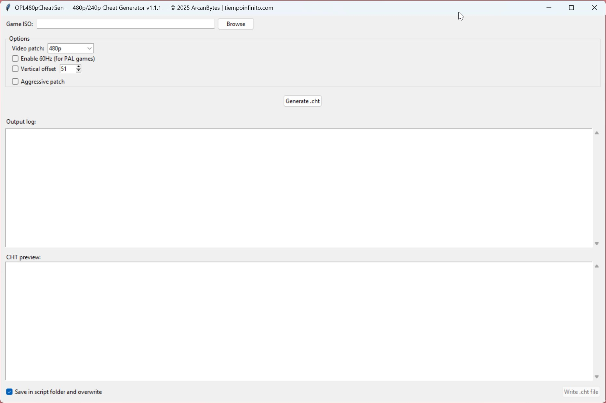

# OPL480pCheatGen


**OPL480pCheatGen** is a tool for generating `.cht` cheat files compatible with [Open PS2 Loader (OPL)](https://github.com/ifcaro/Open-PS2-Loader), allowing you to force 480p, 240p, and progressive video modes in your PlayStation 2 games **without modifying ISOs**.

> ✅ No patching required  
> ✅ Runs offline  
> ✅ Generates `.cht` files for use with OPL  
> ✅ Works directly with ISO files

---

## 📦 Download

You can always get the latest compiled version here:
👉 [Download Latest Release](https://github.com/arcanbytes/OPL480pCheatGen/releases/latest)

---

## ⚙️ Features

- ✅ **Video Mode Detection**: 480p, 240p, and 480i
- ✅ **Auto-detect ELF from ISO** via `SYSTEM.CNF` (no user input needed)
- ✅ **Optional Patches**:
  - Enable PAL 60Hz (for PAL-region games)
  - Force 240p output
- ✅ **Fully Offline**: Loads titles and mastercodes from a built-in database (5300+ entries)
- ✅ **Supports GUI and CLI**

---

## 🖥️ Graphical Interface (Recommended)

Run `OPL480pCheatGenGUI.exe`:

- Select an ISO 
- Choose your patch options
- Preview the `.cht` content
- Click **Write .cht file** to save

✔️ Saves `.cht` next to the `.exe` by default  
✔️ Ideal for use with OPL Manager Cheat Editor 



---

## 🧪 Command-Line Interface

Run the tool directly via Python or the `.exe`:

```bash
# Basic usage examples
python OPL480pCheatGen.py "Game.iso"
python OPL480pCheatGen.py "F:\RetroBat\roms\ps2\Game.iso" --preview --force-240p

# Optional flags:
--preview-only        # Show .cht content in console, do not write file
--pal60               # Enable PAL 60Hz mode (for PAL games)
--force-240p          # Use 240p instead of 480p
--mastercode "..."    # Manually override mastercode
```

---

## 📝 License

MIT License – see LICENSE file for details.
Copyright (c) 2025 ArcanBytes<br>


---

## 🙏 Credits

Created by ArcanBytes, built for the PS2 homebrew and OPL community.<br> 
Mastercode database based on: [PS2-Widescreen/Bare-Mastercodes-bin](https://github.com/PS2-Widescreen/Bare-Mastercodes-bin)<br>
Original inspiration / idea: [asmodean's ps2force480p](http://asmodean.reverse.net/pages/ps2force480p.html)